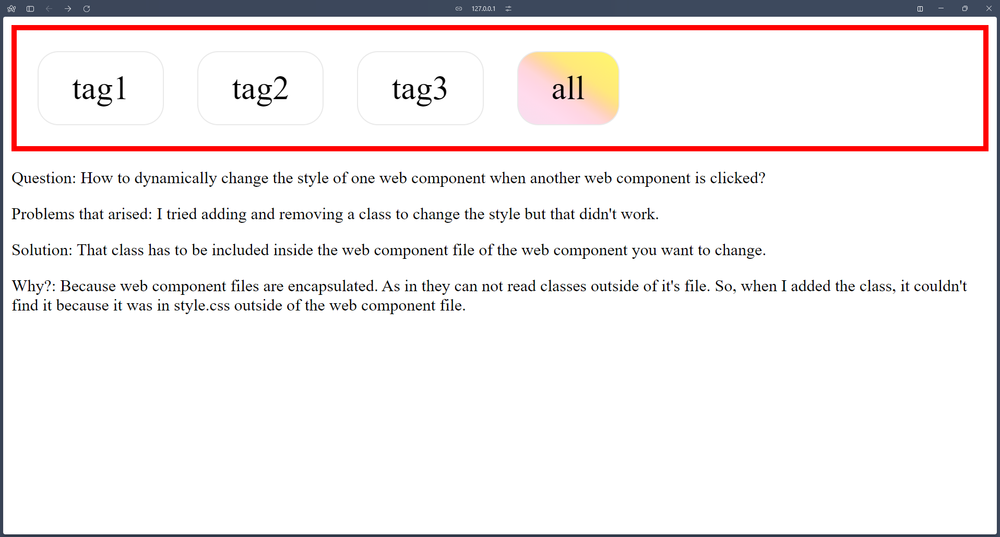

# Question: How to dynamically change the style of one web component when another web component is clicked?

Problems that arised: I tried adding and removing a class to change the style but that didn't work.

Solution: That class has to be included inside the web component file of the web component you want to change.

Why?: Because web component files are encapsulated. As in they can not read classes outside of it's file. So, when I added the class, it couldn't find it because it was in style.css outside of the web component file.

# How to see this demo

In VSCode...

Install Live Server. 
Extension Id: ritwickdey.LiveServer

Then, download these files, put them in a folder in your desktop, open that folder using VScode and then on the bottom right corner click on "Go Live". 

